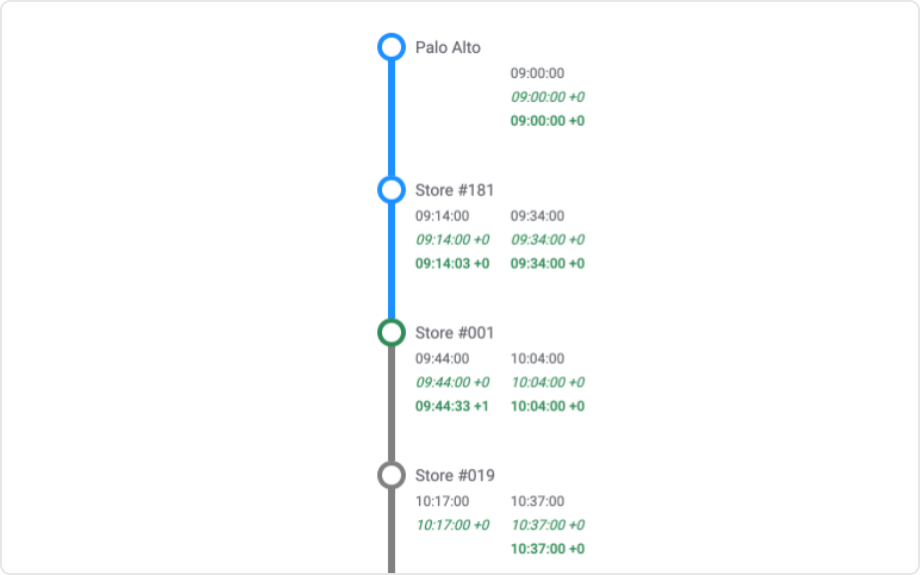

# Stop Times Mod for Spotfire®

A graphical representation of stops for a vehicle journey with scheduled, estimated times and delays. It has application in public transportation and logistics use cases and works great with streaming data.

## Installation & Use

[Download latest version](https://github.com/spotfiresoftware/spotfire-mod-stoptimes/releases)

The [Wiki](https://github.com/spotfiresoftware/spotfire-mod-stoptimes/wiki) contains step-by-step instruction on how to install and use this Mod in Spotfire®.

## Building the Project

In a terminal window:
- `npm install`
- `npm start`

## About Mods for Spotfire®
-   [Spotfire Community Exchange](https://community.spotfire.com/files/): A safe and trusted place to discover ready-to-use Mods
-   [Developer documentation](https://spotfiresoftware.github.io/spotfire-mods/docs/): Introduction and tutorials for Mods developers
-   [Mods examples](https://github.com/TIBCOSoftware/spotfire-mods/): A public repository for examples projects
